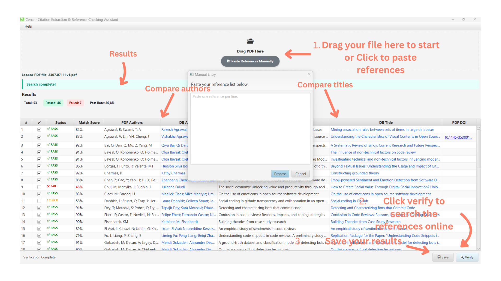

# CERCA – Citation Extraction & Reference Checking Assistant

**CERCA** is an open-source research tool that supports **verification of bibliographic references** in scientific manuscripts. It extracts references from PDF files and checks their existence and consistency against authoritative metadata sources, producing **explainable diagnostics, audit logs, and reproducible reports**.



---

## Key Features

- 📄 **Local PDF parsing** and reference extraction. 
    * Drag-and-drop a PDF to automatically extract citations  
- 🔍 **Reference verification** using Crossref and Zenodo metadata  
- 📊 **Match scores** based on title, authors, and DOI similarity 
- **Interactive Dashboard:** 
    * View real-time Pass/Fail statistics and verification rates.
    * Color-coded status badges for quick visual assessment.  
- 📁 **Export Data:** Save verification reports for further analysis.
    * 🧾**CSV export** for analysis 
    * 🧾 **Diagnosis report** (TXT) 
- 🪵 **Audit log** for transparency and reproducibility  
- 🔎 **Right-click search** (Google / Google Scholar) for manual inspection  
- 🔒 **Local privacy by design** — PDFs never leave your machine  

---

## 📦 How to Run

### Windows
1. Download **`Cerca_windows.zip`**.
2. Unzip the file.
3. Double-click Cerca-1.0-alpha.jar.

If Windows shows a security warning, choose More info → Run anyway.

### macOS
1. Download **`Cerca_mac.zip`**.
2. Unzip it.
3. Right-click **`Cerca-1.0-alpha.jar`** and select **Open**.
   * *Note: Since this is an unverified alpha app, you may need to go to System Settings > Privacy & Security to allow it to run.*

### Linux
1. Download **`Cerca_linux.zip`**.
2. Unzip it.
3. Open a terminal in that folder and run:
   ```bash
   		java -jar Cerca-1.0-alpha.jar   
   
  ---

## 🔒Privacy & Local Processing

CERCA is designed with researcher privacy in mind.

- All PDF parsing and reference extraction are performed **locally**
- Manuscripts are **never uploaded, stored, or shared**
- CERCA performs **metadata-only lookups** (e.g., DOI, title, authors)


---

## How It Works

1. A PDF file is parsed locally to extract bibliographic references
2. Each reference is queried against:
   - **Crossref**
   - **Zenodo**
3. Metadata fields (title, authors, DOI) are compared
4. CERCA assigns:
   - A **match score**
   - A **status** (PASS / CHECK / FAIL)
   - A short **diagnostic explanation**
5. Results can be saved as:
   - TXT report (diagnosis)
   - CSV table
6. Audit logs
    - Logs are saved for **transparency and reproducibility**

---

## Status Definitions

- **PASS** – Strong metadata agreement with authoritative sources  
- **CHECK** – Partial or ambiguous match; manual inspection recommended  
- **FAIL** – No reliable metadata match found at time of verification  

CERCA is an experimental tool. It does not replace manual verification.

---

## Outputs

CERCA generates the following artifacts:

- **TXT report** – Summary and per-reference diagnostics  
- **CSV file** – Structured results for analysis or editorial review  
- **Audit log** – Timestamped record of verification steps  

These outputs support **reproducibility, transparency, and review documentation**.

---

## Intended Use

CERCA is intended for:

- Researchers performing final manuscript checks
- Reviewers assessing reference consistency
- Editors supporting editorial quality control
- Meta-research and reproducibility workflows

---

## Limitations

- Verification depends on availability and correctness of external metadata
- Some valid references (e.g., books, technical reports, older works) may not be indexed
- Match scores are heuristic and intended to support human analysis

---

## License

This project is licensed under the  
**GNU Affero General Public License, Version 3.0 (AGPL-3.0)**.

See the `LICENSE` file for details.

---

## Third-Party Credits

This software uses the **CERMINE** library, licensed under **GNU AGPL v3**.

**CERMINE**  
Copyright © Centre for Open Science  

Dominika Tkaczyk, Paweł Szostek, Mateusz Fedoryszak,  
Piotr Jan Dendek, Łukasz Bolikowski  

*CERMINE: automatic extraction of structured metadata from scientific literature.*  
International Journal on Document Analysis and Recognition, 2015,  
Vol. 18, No. 4, pp. 317–335, DOI: 10.1007/s10032-015-0249-8

---

## Citation

If you use CERCA in your research, please cite it as research software.

---

## Author

**Lidiany Cerqueira, PhD**    
Computer Science Researcher  
[lidianycs.site](https://lidianycs.site/)

---

## Acknowledgments

CERCA was developed to support rigorous, transparent, and responsible research practices.
